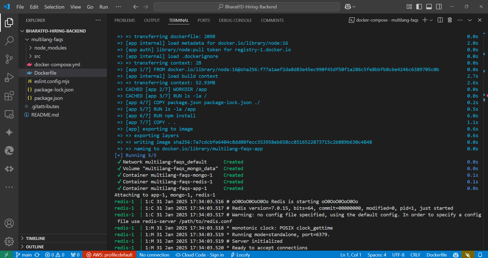
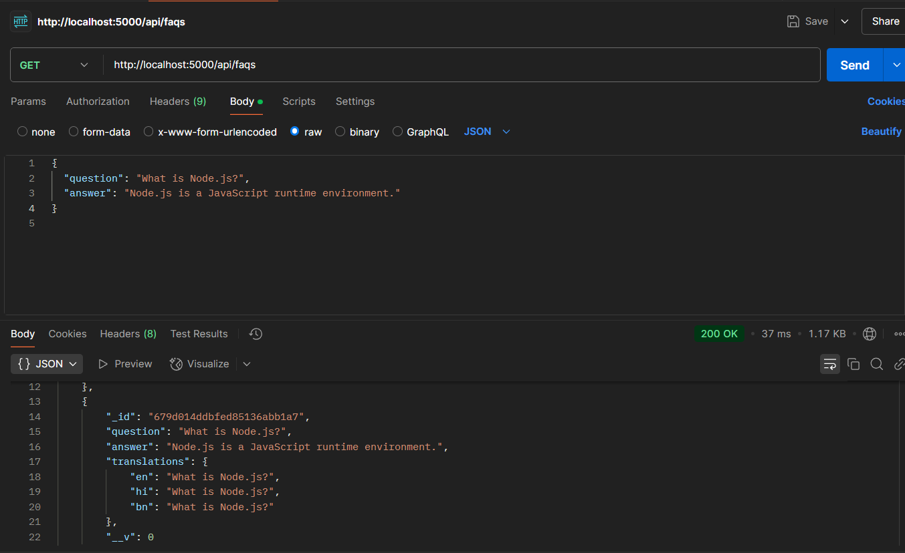

# BharatFD-Hiring-Backend
# Multilingual FAQ Backend (Node.js & Express)

## Overview
This repository contains the backend implementation for a **Multilingual FAQ System** using **Node.js** and **Express.js**. The project allows users to store and retrieve FAQs in multiple languages using **Google Translate API** for automatic translations.

## Features
- REST API for managing FAQs (Create & Retrieve).
- **Multi-language support** (English, Hindi, Bengali).
- **Google Translate API Integration** for automatic translations.
- **MongoDB** as the database with Mongoose ODM.
- **Docker Support** for easy deployment.
- **Unit Testing** using Mocha & Supertest.
- **Error Handling & Logging** for better debugging.

---

## How to Run the Project
### **1. Clone the Repository**
```bash
 git clone https://github.com/your-username/multilingual-faqs.git
 cd multilingual-faqs
```

### **2. Install Dependencies**
```bash
npm install
```

### **3. Configure Environment Variables**
Create a `.env` file in the root directory and add:
```env
MONGO_URI=your-mongodb-uri-here
GOOGLE_TRANSLATE_API_KEY=your-google-translate-api-key-here
```

### **4. Start the Server**
```bash
npm run dev
```

The server should now be running at `http://localhost:5000`.

---

## 📌 API Usage
### **1. Fetch FAQs**
#### Request (English - Default)
```bash
curl http://localhost:5000/api/faqs/
```
#### Request (Hindi)
```bash
curl http://localhost:5000/api/faqs/?lang=hi
```
#### Request (Bengali)
```bash
curl http://localhost:5000/api/faqs/?lang=bn
```
#### Response Format
```json
[
  {
    "question": "What is Node.js?",
    "answer": "Node.js is a runtime for executing JavaScript outside the browser.",
    "translations": {
      "hi": "Node.js ब्राउज़र के बाहर जावास्क्रिप्ट चलाने के लिए एक रनटाइम है।",
      "bn": "Node.js হল একটি রানটাইম যা ব্রাউজারের বাইরে জাভাস্ক্রিপ্ট চালানোর জন্য ব্যবহৃত হয়।"
    }
  }
]
```

### **2. Add a New FAQ**
#### Request
```bash
curl -X POST http://localhost:5000/api/faqs/ \
  -H "Content-Type: application/json" \
  -d '{
    "question": "What is Express.js?",
    "answer": "Express.js is a minimal and flexible Node.js web application framework."
  }'
```
#### Response
```json
{
  "message": "FAQ added successfully",
  "faq": {
    "question": "What is Express.js?",
    "answer": "Express.js is a minimal and flexible Node.js web application framework.",
    "translations": {
      "hi": "Express.js एक न्यूनतम और लचीला Node.js वेब एप्लिकेशन फ्रेमवर्क है।",
      "bn": "Express.js হল একটি ন্যূনতম এবং নমনীয় Node.js ওয়েব অ্যাপ্লিকেশন ফ্রেমওয়ার্ক।"
    }
  }
}
```

---

## 🛠 Problems Faced & Debugging

### **1. Missing MongoDB URI in .env**
- Issue: `Error: MongoDB URI is not defined in .env file.`
- Fix: Ensured that the `.env` file contains the correct `MONGO_URI`.

### **2. Google Translate API Permission Denied (403 Error)**
- Issue: `Method doesn't allow unregistered callers.`
- Fix: Ensured that the API key is properly configured in **Google Cloud Console**.

### **3. `express.Router().get()` Error**
- Issue: `Route.get() requires a callback function but got [object Undefined]`
- Fix: Verified that the controller functions are correctly imported and assigned.

### **4. Testing Issues (`mocha` missing dependencies)**
- Issue: `Error: Cannot find module 'diff'`
- Fix: Ran `npm install mocha chai supertest --save-dev` to install missing test dependencies.

---

## 🐳 Docker Setup
### **1. Build the Docker Image**
```bash
docker build -t multilingual-faqs .
```
### **2. Run the Container**
```bash
docker run -p 5000:5000 multilingual-faqs
```
### **Docker Screenshot Placeholder**


---

## 🧪 Testing
Run unit tests using Mocha & Supertest:
```bash
npm test
```

### **Test Case: Fetch FAQs**
```javascript
describe('GET /api/faqs', () => {
    it('should return FAQs', async () => {
        const res = await request(app).get('/api/faqs');
        expect(res.statusCode).toBe(200);
    });
});
```
<!-- 
### **Test Results Placeholder**
 -->

---

## 📌 Screenshots & Proof of Execution
### **Input Request Screenshot**


### **Output Response Screenshot**


### **Docker Running Screenshot**


---

## 📝 Conclusion
This project successfully implements a **Multilingual FAQ System** using **Node.js & Express.js**, integrating **Google Translate API**, **MongoDB**, and **Docker Support**. The system handles translations dynamically and follows best practices for API development, error handling, and testing.


